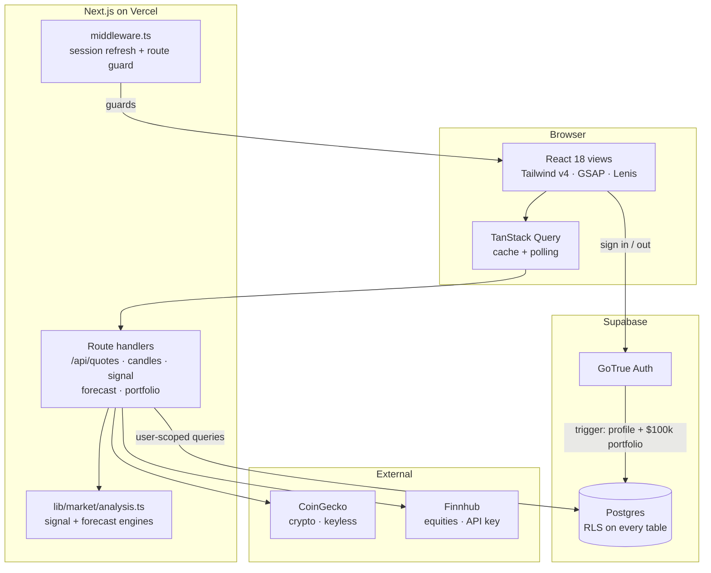

<div align="center">

# Veltrix

**A market analytics terminal where every number traces back to the data behind it.**

Live crypto & equity pricing · an auditable technical signal engine · walk-forward-validated
forecasting · paper trading with row-level-secured portfolios.

[](https://nextjs.org)
[](https://www.typescriptlang.org)
[](https://supabase.com)
[](https://tailwindcss.com)
[](https://vercel.com)

</div>

---

## Why this exists

Most trading dashboards show you a confident number and hide how they got it. A "92% confidence
BUY signal" is easy to render and impossible to check.

Veltrix is built on the opposite premise: **if a number can't be traced, it doesn't ship.**

- Every BUY/SELL exposes the individual indicator votes that produced it, with weights.
- Forecast confidence is a *measured* walk-forward hit-rate — when the model has no edge,
  the UI says ~50% instead of inventing certainty.
- There are no mock data paths. If a provider is unavailable, the screen says so rather
  than falling back to invented prices.

That constraint drove most of the architecture below.

---

## Live demo

```
email     demo.veltrix@gmail.com
password  VeltrixDemo2026
```

The demo account carries a seeded BTC/ETH/SOL portfolio so the P&L views are populated.
Crypto data requires no API key, so the deployment works out of the box.

---

## Architecture



### Request path, end to end

1. **`middleware.ts`** runs on every non-static request, refreshes the Supabase session cookie,
   and redirects unauthenticated users away from `/dashboard`, `/trade`, `/markets`,
   `/portfolio`, `/settings`.
2. **Route handlers** fetch OHLC/quotes from the providers, run the analysis engines
   server-side, and return plain JSON. Market endpoints use Next's `revalidate` for caching;
   `/api/portfolio` is `force-dynamic` because it is per-user.
3. **Postgres reads** go through the caller's JWT, so RLS — not application code — is the
   authorisation boundary.

---

## The signal engine

`computeSignal()` scores five technical components, each casting a weighted vote:

| Component | Weight | Bullish when | Bearish when |
|---|---|---|---|
| RSI (14) | 1.0 | < 30 (oversold) | > 70 (overbought) |
| MACD (12,26,9) | 0.8 | histogram > 0 | histogram < 0 |
| Bollinger (20,2) | 0.6 | close below lower band | close above upper band |
| Trend EMA20/SMA20 | 0.5 | price > EMA20 > SMA20 | price < EMA20 < SMA20 |
| Volume vs 20-bar avg | 0.3 | > 1.5× average | — |

The votes are summed, normalised to `[-1, +1]`, and thresholded: **BUY above +0.3, SELL below −0.3.**

Two deliberate correctness details:

- **The momentum figure is rounded *before* thresholding.** Floating-point (`0.8 - 0.5 =
  0.30000000000000004`) otherwise makes a score of exactly 0.3 render as "0.30" beside a BUY,
  contradicting the stated rule.
- **Bullish/bearish probabilities derive from the same momentum that sets the signal**, so the
  headline and the odds can never disagree.

Every component — including neutral ones — is returned to the client with its measured value,
vote and weight. The UI renders all of them.

---

## The forecast engine

Three models, ensembled by **inverse-RMSE weights from a walk-forward backtest** — a model only
earns weight by actually predicting held-out data:

| Model | Method |
|---|---|
| `drift_ewma` | Geometric drift (shrunk 0.5× toward zero) with RiskMetrics EWMA volatility, λ = 0.94 |
| `ar` | AR(5) on log returns, OLS via normal equations + Gaussian elimination, iterated forward |
| `naive` | Random walk — the benchmark every other model must beat |

Confidence bands are 95% intervals from the EWMA sigma scaled by √horizon.

**Reported metrics are measured, not asserted.** MAE, RMSE and directional hit-rate come from a
one-step-ahead walk-forward evaluation over up to 40 held-out points. A hit-rate near 50% means
no directional edge, and the UI states exactly that.

> Drift is shrunk toward zero on purpose: short-window drift estimates are mostly noise, and an
> honest model does not extrapolate them at full strength.

---

## Data providers

| Source | Covers | Key required | Notes |
|---|---|---|---|
| **CoinGecko** | 10 crypto assets | No | `/ohlc` only accepts 1/7/14/30/90/180/365 days — other values silently return `[]`, so requests snap to the nearest supported value |
| **Finnhub** | 10 equities | `FINNHUB_API_KEY` | Absent key returns an explicit `unavailable` marker; the UI shows a "not configured" state rather than invented prices |

Granularity note: CoinGecko returns 4-hour bars at 30 days but degrades to sparse 4-day bars
above 90, so the signal engine requests 30 days (~180 points) to keep indicators well-fed.

---

## Data model

```sql
profiles    (id → auth.users, email, display_name)
portfolios  (id, user_id → auth.users, name, cash)
positions   (id, portfolio_id → portfolios, symbol, asset_type, quantity, avg_price)
watchlist   (id, user_id → auth.users, symbol, asset_type)
```

RLS is enabled on all four. `portfolios` and `watchlist` match on `auth.uid()`; `positions` is
owned transitively via an `EXISTS` check against the parent portfolio.

A `handle_new_user` trigger on `auth.users` provisions a profile and a $100,000 paper portfolio
on signup, so a new account is immediately usable.

**Verified, not assumed:** an authenticated request returns only that user's rows; the same
query with the anon key alone returns `[]`.

---

## Tech stack

| Layer | Choice |
|---|---|
| Framework | Next.js 14 (App Router, RSC + route handlers) |
| Language | TypeScript, strict |
| Styling | Tailwind CSS v4 with CSS-variable design tokens |
| Charts | `lightweight-charts` v5 (area + candlestick) |
| Motion | GSAP + ScrollTrigger, Lenis smooth scroll, Framer Motion |
| Data layer | TanStack Query |
| Auth & DB | Supabase (GoTrue + Postgres with RLS) |
| Hosting | Vercel |

### Design system

Near-black surfaces (`#0B0D10` page, `#14171C` card), a single lime accent (`#C6F24E`), 24px
card radius, oversized tabular figures. Market semantics reuse the accent for "up" and
`#F87171` for "down".

The landing hero is a generative canvas: the **real 30-day BTC close series**, normalised and
drawn as five phase-offset ribbons with additive glow and cursor parallax. The artwork is the
data.

**Two accessibility rules the codebase enforces:**

1. The preloader locks body scroll, so it carries a 4-second failsafe that force-releases.
   Gating scroll on an animation completing can trap a visitor whose `requestAnimationFrame`
   is throttled or whose bundle is blocked.
2. Entrance animations are **transform-only**. Animating opacity on entrance can leave content
   permanently invisible if the animation never runs.

Every motion primitive no-ops under `prefers-reduced-motion`.

---

## Running locally

```bash
git clone https://github.com/VenkataVinesh/Veltrix.git
cd Veltrix
npm install
npm run dev
```

Open <http://localhost:3000>. It runs with **no configuration** — it falls back to the public
demo Supabase project, and crypto data needs no key.

To point at your own backend, copy `.env.example` to `.env.local`:

```bash
NEXT_PUBLIC_SUPABASE_URL=https://your-project.supabase.co
NEXT_PUBLIC_SUPABASE_ANON_KEY=sb_publishable_xxxxxxxx
FINNHUB_API_KEY=            # optional — enables equities
```

> The Supabase **publishable/anon** key is designed to ship in client bundles; it grants no
> privileges by itself. RLS is the security boundary. Never put the *service role* key here.

```bash
npm run build      # production build
npx tsc --noEmit   # type check
```

---

## Project layout

```
app/
  (app)/           dashboard · trade · markets · portfolio · settings  (auth-guarded)
  api/             quotes · candles · signal · forecast · portfolio
  login/ signup/   Supabase auth
  page.tsx         cinematic landing
components/
  motion/          preloader, kinetic text, reveals, magnetic, cursor, marquee
  views/           one component per screen
  hero-canvas.tsx  generative live-data hero
  price-chart.tsx  lightweight-charts wrapper
lib/
  market/          providers.ts (CoinGecko/Finnhub) · analysis.ts (signal + forecast)
  supabase/        client · server · config
middleware.ts      session refresh + route guarding
```

---

## Honest limitations

Stated plainly, because the whole point of the project is not overclaiming:

- **Sell orders are not implemented.** The button is visibly disabled and labelled.
- **Paper trading only.** No broker integration; no real order ever leaves the browser.
- **Not investment advice.** The signal engine is a transparent technical composite, not alpha.
- **Free-tier rate limits.** CoinGecko and Finnhub both throttle; heavy refreshing will 429.
- **Equities need a key.** Without `FINNHUB_API_KEY` the app is crypto-only, and says so.

---

## Licence

MIT — see [LICENSE](LICENSE).

Built by **A. Venkata Vinesh Kumar Reddy** ·
[Portfolio](https://venkatavinesh.github.io/PortFolio_Build_Gem/) ·
[LinkedIn](https://www.linkedin.com/in/venkat-vinesh)
