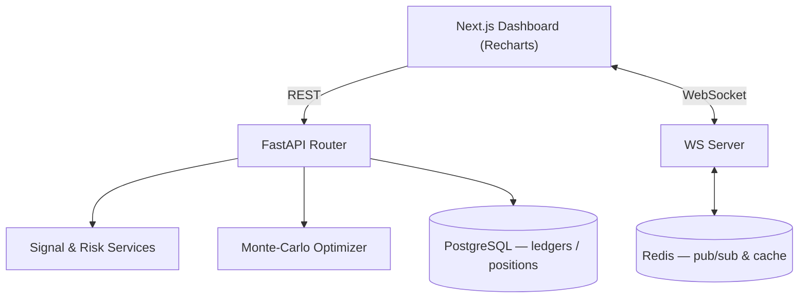

# Veltrix — Algorithmic Trading & Backtesting Platform


Veltrix is a full-stack **quantitative research and strategy-backtesting workspace**. A Next.js
dashboard talks to a FastAPI service that computes technical signals, runs Monte-Carlo portfolio
optimization, calculates risk metrics, and streams telemetry over WebSockets.

## What it does
- **Portfolio optimization engine** — vectorized **Monte-Carlo** simulation over weight vectors to
  maximize the Sharpe ratio, building the mean-variance efficient frontier from a daily-returns
  covariance matrix.
- **Signal engine** — SMA/EMA crossovers, RSI, MACD, Bollinger Bands, ATR on historical OHLCV.
- **Risk analytics** — Value-at-Risk and Expected Shortfall (CVaR), portfolio concentration (HHI),
  and scenario stress tests.
- **Real-time telemetry** — price/log/status streamed to the UI via full-duplex WebSockets.
- **Containerized** — Next.js + FastAPI + PostgreSQL + Redis via Docker Compose.

## Architecture



## Project structure
```
app/            # Next.js frontend (pages, routing)
backend/        # FastAPI service
  app/          # api/ · db/ (SQLAlchemy) · services/ · ws/
  ml/           # indicators + feature pipeline
components/     # React UI
docker/         # compose + container defs
tradingagents/  # agent workflow orchestration
```

## Quick start
```bash
# Backend
cd backend && python -m venv venv && source venv/Scripts/activate
pip install -r requirements-dev.txt
python bootstrap.py                 # verifies env + seeds local DB
uvicorn app.main:app --reload --port 8000     # docs → /docs

# Frontend (repo root)
npm install && npm run dev          # → http://localhost:3001
```

### Configuration & credentials
Copy `.env.example` → `.env` and fill in your own values. **Do not commit `.env`.**

`bootstrap.py` seeds local demo accounts for development. Set their passwords via environment
variables (see `.env.example`) rather than hardcoding — e.g. `SEED_ADMIN_PASSWORD`,
`SEED_DEMO_PASSWORD`. (Earlier revisions of this README listed demo passwords inline; those have
been removed and should be rotated.)

## Math (optimization core)
Expected returns $\mu_i = \frac{1}{N}\sum_t R_{i,t}$, portfolio variance $\sigma_p^2 = w^\top\Sigma w$,
maximize $\frac{w^\top\mu - R_f}{\sqrt{w^\top\Sigma w}}$ s.t. $\sum_i w_i = 1,\ 0\le w_i\le 1$.

> _Add a dashboard screenshot/GIF here._
