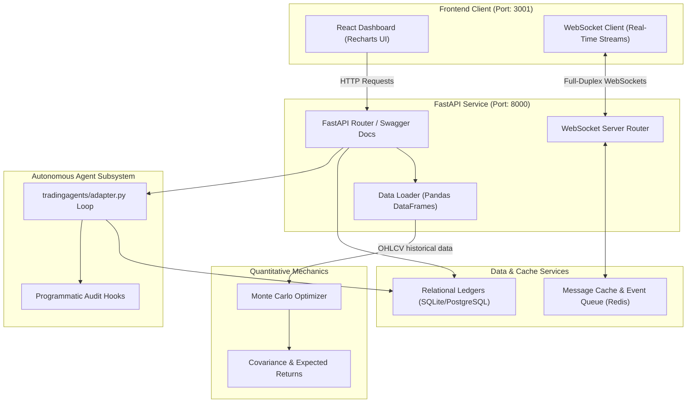

# VELTRIX: Quantitative Research, Strategy Backtesting, and Portfolio Optimization Platform

VELTRIX is an interactive, full-stack quantitative research and algorithmic strategy backtesting platform. The platform integrates a TypeScript dashboard built on Next.js with a FastAPI Python service to compute portfolio allocations, calculate technical trading indicators, run backtesting simulations, and audit agent-driven trading workflows.

---

## Overview

The platform provides a modular workspace for quantitative researchers and software engineers. It supports real-time market telemetry, portfolio risk metrics computation (Value at Risk, Expected Shortfall), historical signal analysis, and simulation-based portfolio optimization.

---

## Features

- **Portfolio Optimization Engine**: Evaluates expected asset returns and historical covariance matrices. It computes mean-variance frontiers and optimizes Sharpe ratios using simulation-based weight allocation frameworks.
- **Rule-Based Signal Engines**: Implements technical analysis indicators (Simple/Exponential Moving Averages, RSI momentum crossovers, MACD, and Bollinger Bands) on historical daily OHLCV datasets.
- **Autonomous Agent Loop**: Integrates a modular multi-agent consensus runtime (`tradingagents/adapter.py`) with audit logging, relational ledger storage, and transaction validation.
- **Real-Time Telemetry**: Streams price updates, service logs, and agent statuses via full-duplex WebSocket connections.
- **Containerized Infrastructure**: Orchestrates services including the Next.js frontend, FastAPI backend, PostgreSQL ledger database, and Redis cache/event bus.

---

## System Architecture

The following diagram illustrates the data flow, network boundaries, and database relationships within the VELTRIX environment:



---

## Project Structure

```
├── app/                      # Next.js frontend pages and routing
├── backend/                  # FastAPI service and quantitative core
│   ├── app/                  # Application router, database session, schemas, and services
│   │   ├── api/              # API endpoints and middleware dependencies
│   │   ├── db/               # SQLAlchemy models and migrations
│   │   ├── services/         # Portfolio, risk, signals, and market services
│   │   └── ws/               # WebSocket event handlers and managers
│   ├── ml/                   # Quantitative indicators and modeling scripts
│   │   ├── training/         # Local model training implementations
│   │   ├── inference/        # Feature building and predictions
│   │   └── feature_pipeline.py # Indicator calculations (EMA, RSI, MACD, etc.)
│   └── tests/                # Unit and integration test suites
├── components/               # Reusable React components and UI views
├── docker/                   # Container definitions and configurations
└── tradingagents/            # Agent adapters and workflow orchestration
```

---

## Portfolio Optimization Engine

VELTRIX runs mathematical and statistical simulations to optimize asset weights in a given portfolio. Using a historical Daily Price Returns Matrix, the optimization pipeline computes:

1. **Expected Returns Vector ($\mu_i$):**
   $$\mu_i = \frac{1}{N} \sum_{t=1}^{N} R_{i, t}$$
   where $R_{i, t}$ is the daily return of asset $i$ at time $t$.

2. **Portfolio Variance ($\sigma_p^2$):**
   $$\sigma_p^2 = w^T \Sigma w$$
   where $w$ is the portfolio weights vector and $\Sigma$ is the covariance matrix of daily asset returns.

3. **Sharpe Ratio Maximization:**
   $$\max_{w} \frac{w^T \mu - R_f}{\sqrt{w^T \Sigma w}} \quad \text{subject to} \quad \sum_{i} w_i = 1, \quad 0 \le w_i \le 1$$
   where $R_f$ is the risk-free rate. 

VELTRIX implements a vectorized Monte Carlo simulation to evaluate randomized weight vectors ($w$), filtering out allocations that exceed target volatility thresholds to find the configuration that maximizes expected risk-adjusted returns.

---

## Trading Infrastructure

The trading infrastructure provides core services to evaluate market data and run signals:

- **Technical Analysis (TA) Engine**: Computes rolling statistics including SMA, EMA, RSI, MACD, Average True Range (ATR), and Bollinger Bands. These form the base feature vectors for trading decisions.
- **Risk Analytics Engine**: Calculates Value at Risk (VaR) and Expected Shortfall (CVaR) using historical and Monte Carlo simulation techniques. Evaluates portfolio concentration metrics via the Herfindahl-Hirschman Index (HHI).
- **Stress-Testing Engine**: Models portfolio performance under historical macroeconomic scenarios (e.g., interest rate shocks, high inflation surprise, sudden volatility spikes).
- **Execution Logging**: Maintains transaction ledgers and audits positions, logging historical cost basis, realized gain/loss, and commission costs.

---

## Local Development

Ensure you have Python 3.11+, Node.js 18+, and npm installed on your system.

### 1. Backend Service
Configure dependencies, initialize the database, and boot the ASGI web server:
```bash
cd backend
python -m venv venv
source venv/Scripts/activate     # Use venv\Scripts\activate on Windows
python -m pip install -r requirements-dev.txt
python bootstrap.py              # Verifies environment and seeds SQLite database
python -m uvicorn app.main:app --reload --port 8000
```
- **Swagger Documentation**: Interact with API endpoints directly at `http://localhost:8000/docs`.

### 2. Frontend Client
Install package dependencies and start the Next.js development server:
```bash
# Run from root directory
npm install
npm run dev
```
- **Interactive Dashboard**: Access the interface at `http://localhost:3001`.

### Local Seeding & Test Credentials
The `bootstrap.py` script automatically seeds the database with the following developer credentials:

| Role | Username / Email | Password | Database |
|---|---|---|---|
| **System Administrator** | `admin@veltrix.ai` | `Admin123!` | SQLite / PostgreSQL |
| **Standard Trader** | `demo@veltrix.ai` | `Demo123!` | SQLite / PostgreSQL |

---

## Deployment

### Multi-Service Compose (Production Profile)
Deploy the Next.js dashboard, FastAPI service, PostgreSQL database, and Redis cache in unified containers:
```bash
docker-compose -f docker/docker-compose.yml up --build
```
- **PostgreSQL**: Stores persistent ledger tables, position audits, and signal history.
- **Redis**: Coordinates WebSocket publish/subscribe events and caches model query responses.

---

## API Reference

### REST API Endpoints

| Endpoint | Method | Authentication | Description |
|---|---|---|---|
| `/api/v1/auth/login` | `POST` | None | Authenticates user and returns JWT. |
| `/api/v1/portfolio/` | `GET`, `POST` | JWT Required | Creates and retrieves portfolios. |
| `/api/v1/portfolio/{id}/positions` | `GET`, `POST` | JWT Required | Manages active assets within a portfolio. |
| `/api/v1/signals/` | `GET` | JWT Required | Fetches technical indicators and trend statistics. |
| `/api/v1/agents/debate` | `POST` | JWT Required | Triggers multi-agent analyst consensus loop. |
| `/health` | `GET` | None | Verifies backend service status. |

### WebSocket API
Streams market data and telemetries on `ws://localhost:8000/api/v1/stream`:
- **Subscribe to Tickers**: Send `{"action": "subscribe", "symbol": "AAPL"}`.
- **Payload Event Model**: Emits real-time pricing and telemetry updates containing ticker price, daily change percentage, and execution statuses.
